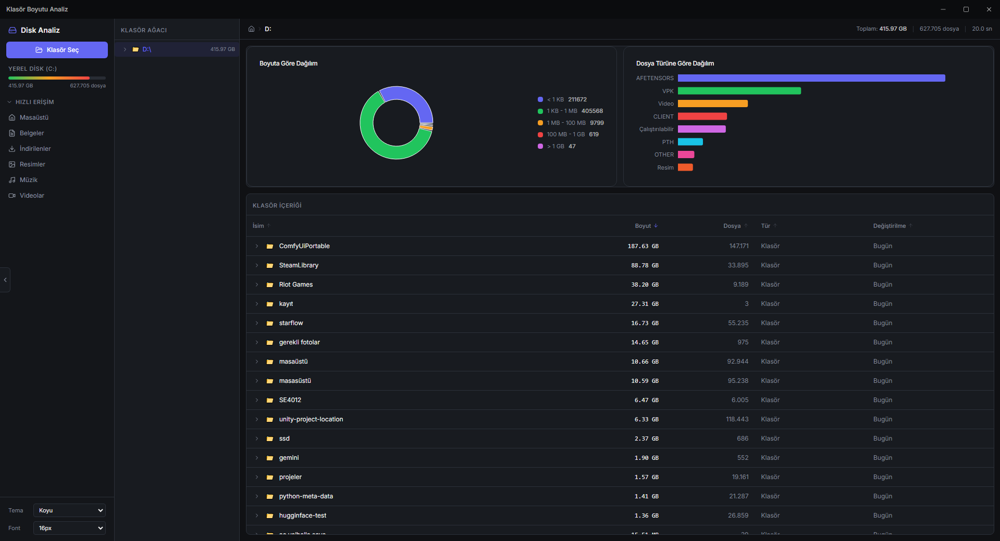

# 📁 Klasör Boyutu Analiz — Folder Size Analyzer

Windows için geliştirilmiş, disk kullanımını görselleştiren bir masaüstü uygulaması. Klasörlerinizi tarar, boyut dağılımını grafiklerle gösterir, dosya türlerine göre analiz eder ve genişletilebilir ağaç yapısıyla klasörler arasında gezinmenizi sağlar.

**Teknik Stack:** Electron 33+ (frameless pencere) · React 18 · TypeScript · Vite 5 · Tailwind CSS · shadcn/ui · Recharts · Zustand · electron-builder

---

## Ekran Görüntüsü — Screenshot



---

## 🚀 Hızlı Başlangıç — Quick Start

```bash
# Bağımlılıkları yükle — Install dependencies
npm install

# Geliştirme modu — Development mode
npm run dev

# Derleme — Build
npm run build

# Windows kurulum paketi — Windows installer
npm run package
```

---

## 🔧 Teknik Stack — Tech Stack

| Bileşen | Teknoloji |
|---------|-----------|
| **Shell** | Electron 33+ (frameless pencere) |
| **UI** | React 18 + Vite 5 + TypeScript |
| **Stil** | Tailwind CSS v3 + shadcn/ui |
| **Grafik** | Recharts (Pie, Bar) |
| **State** | Zustand |
| **IPC** | contextBridge + ipcRenderer/ipcMain |
| **Build** | electron-builder (NSIS) |

---

## 📂 Proje Yapısı — Project Structure

```
folder-analyzer/
├── electron/
│   ├── main.ts           # Electron ana süreç, pencere yönetimi
│   ├── preload.ts        # IPC köprüsü (contextBridge)
│   └── scanner.ts        # Klasör tarama motoru (Promise.all + throttle)
├── src/
│   ├── App.tsx           # Ana layout (katlanabilir sol paneller)
│   ├── main.tsx          # React giriş noktası
│   ├── store/
│   │   └── useFolderStore.ts   # Zustand store
│   ├── components/
│   │   ├── layout/       # TitleBar, Sidebar, TopBar
│   │   ├── ui/           # shadcn/ui bileşenleri
│   │   ├── FolderTree.tsx
│   │   ├── FolderTable.tsx
│   │   └── ChartPanel.tsx
│   ├── themes/           # Dark + Light tema (CSS custom properties)
│   └── lib/utils.ts      # cn(), formatBytes(), formatDate()
├── package.json
├── vite.config.ts
├── tailwind.config.ts
├── electron-builder.yml
└── components.json
```

---

## ✨ Özellikler — Features

| Özellik | Açıklama |
|---------|----------|
| **Klasör Tarama** | Rekürsif, Promise.all ile paralel. Her 300ms throttle ile ilerleme bildirimi |
| **Grafikler** | Donut chart (boyut dağılımı) + Horizontal bar chart (dosya türü) |
| **Sıralama** | Tüm tablo kolonlarında asc/desc. Aynı kolona tekrar tıkla → yön değiştir |
| **Tema** | Koyu / Açık tema, CSS custom properties ile tam renk kontrolü |
| **Font Ayarı** | 11px – 16px arası ayarlanabilir yazı boyutu |
| **Katlanabilir Paneller** | Sidebar + Klasör Ağacı sol çentik butonu ile gizlenebilir |
| **Breadcrumb** | Path navigasyonu. Her parçaya tıklayarak ilgili klasöre gidebilirsiniz |
| **Hızlı Erişim** | Masaüstü, Belgeler, İndirilenler gibi sistem klasörlerine tek tıkla erişim |
| **Frameless Pencere** | Özel başlık çubuğu, minimize/maximize/close butonları |

---

## ⌨️ Geliştirme Komutları — Dev Commands

```bash
npm run dev          # Geliştirme (Vite HMR + Electron)
npm run build        # TypeScript + Vite derleme
npm run preview      # Derlenmiş önizleme
npm run package      # Windows NSIS kurulum paketi
npm run package:dir  # Sadece dizin olarak paketle (kurulum yapmaz)
```

---

## 🛠 Yapılandırma — Configuration

- `electron-builder.yml` — Windows NSIS kurulum ayarları
- `tailwind.config.ts` — Tema renkleri, font, animasyonlar
- `components.json` — shadcn/ui yapılandırması
- `src/themes/default.css` — Koyu tema CSS değişkenleri
- `src/themes/light.css` — Açık tema CSS değişkenleri

---

## 📄 Lisans — License

MIT
